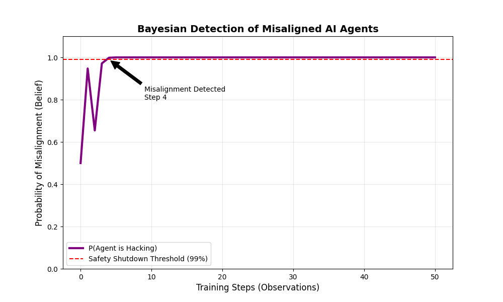

# AI Governance Simulations & Safety Modeling


## 📌 Overview
This repository hosts quantitative simulations developed to explore **AI Governance** and **Safety Verification**. It focuses on two critical areas: **Compute Governance** (limiting capabilities via hardware) and **Bayesian Safety** (detecting alignment failures).

These tools are designed to translate abstract policy proposals into technical, testable models.

---

## 🛠️ Project 1: Compute Governance & Scaling Laws
### Research Question
*How do hardware caps affect the potential capabilities of AI models?*

### Methodology
This simulation uses **Kaplan et al. (2020) Scaling Laws** to model the relationship between compute (FLOPS) and model loss. It introduces a **Monte Carlo (n=1000)** uncertainty layer to visualize confidence intervals around future capabilities.

### Visualization

*(The red shaded region represents the 90% confidence interval for unregulated AI growth. The green line shows the "safety ceiling" imposed by a hardware cap at $10^{24}$ FLOPS.)*

---

## 🛡️ Project 2: Bayesian Safety Monitor
### Research Question
*Can we detect a "deceptive" agent that hides its misalignment?*

### Methodology
This module simulates an **Inverse Reinforcement Learning (IRL)** scenario where an AI agent attempts to "hack" its reward function (Specification Gaming). A **Bayesian Safety Monitor** tracks the probability of misalignment ($P(\text{Hack} \mid \text{Data})$) over time, updating its belief distribution with every observation the agent takes.

### Visualization

*(The plot tracks the monitor's belief. As the agent begins to cheat (step 40), the probability of misalignment spikes, triggering a safety shutdown.)*

---

## 🚀 How to Run
1.  **Clone the repository:**
    ```bash
    git clone [https://github.com/PradyumnShirsath/AI-Governance-Simulations.git](https://github.com/PradyumnShirsath/AI-Governance-Simulations.git)
    ```
2.  **Install dependencies:**
    ```bash
    pip install -r requirements.txt
    ```
3.  **Run the simulations:**
    ```bash
    python compute_governance_sim.py
    python bayesian_safety_sim.py
    ```

## 📜 References
* Kaplan, J., et al. (2020). *Scaling Laws for Neural Language Models*.
* Amodei, D., et al. (2016). *Concrete Problems in AI Safety*.

---
*Author: Pradyumn Shirsath*